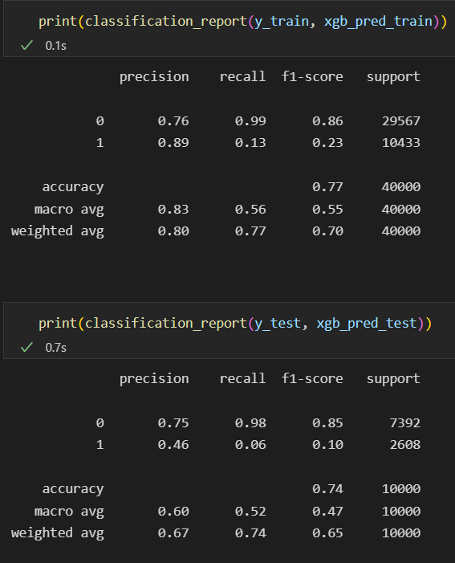

# Report - Model Evaluation

### BASELINE MODEL
I implemented as the baseline model a simple logistic regression with default parameters. This are the metrics obtained for train and test:

The roc-auc score obtained is 0.6422

### OTHER MODELS TRAINED
Previous experiments were implemented with this models: 
- RandomForestClassifier: with default parameters and also implementing a RandomizedSearchCV to search for the best hyperparameters
- LGBMClassifier: with default parameters and also implementing a RandomizedSearchCV to search for the best hyperparameters
- XGBoostClassifier: with default parameters and also implementing a RandomizedSearchCV to search for the best hyperparameters
- MLP deep learning model

### SELECTED MODEL
The model selected for implementing in the API to make predictions was the XGBoost with default parameters, taking into account the values obtained in presicion, recall and the roc-auc score of 0.6411. This are the metrics obtained for train and test:

