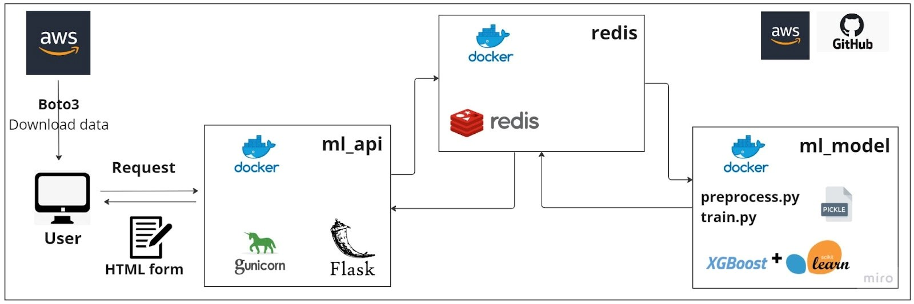

# Flask ML API

A flask API developed with a form in the frontend. Used for a credit risk analysis project where the goal is to predict whether a person is abe to apply for a loan or not, based on data provided through the form. The target value considered is 1 = the person is not able to pay off the credit.
Its composed by three microservices, that are configured to be excecuted with a docker compose yml file:

- API
- redis
- ml_service



## Project structure 

Below is the full project structure:

```
├── api
│   └── static
│   │   ├── images
│   │   └── style
│   ├── templates
│   ├── _init_.py
│   ├── app.py
│   ├── Dockerfile
│   ├── middleware.py
│   ├── requirements
│   └── views.py
├── images_report
├── model
│   └── preprocess
│   │   ├── data
│   │   ├── Dockerfile
│   │   ├── preprocess.py
│   │   ├── requirements.txt
│   │   ├── settings.py
│   │   └── utils.py
│   └── train
│   │   ├── pickles
│   │   ├── Dockerfile
│   │   ├── requirements.txt
│   │   └── train.py
│   ├── _init_.py
│   ├── Dockerfile
│   ├── ml_service.py
│   ├── requirements
│   ├── settings.py
│   └── utils.py
├── notebooks
│   └── EDA.ypinb
│   ├── Model Evaluation.ypinb
│   └── settings.py
├── gitignore
├── docker-compose.yml
├── download.py
├── Model Evaluation report.md
└── README.md
```

A quick overview on each module:

- api: It has all the needed code to implement the communication interface between the users and our service. It uses Flask and Redis to queue tasks to be processed by our machine learning model.
    - `api/app.py`: Setup and launch our Flask api.
    - `api/views.py`: Contains the API endpoints. 
    - `api/settings.py`: It has all the API settings.
    - `api/templates`: Here we put the .html files used in the frontend.
    - `api/middleware`: It has a function that queues jobs into redis and waits for ML model to get a prediction as answer.
- images_report: The images used for the final report.
- model: Implements the logic to get jobs from Redis and process them with our Machine Learning model. When we get the predicted value from our model, we must encole it on Redis again so it can be delivered to the user.
    - `model/preprocess/preprocess.py`: Here we gouped all feature engineering in a single pipeline as to be reused later in the project.
    - `model/train/train.py`: Here I train the selected model.
    - `model/ml_service.py`: Contains functions to get prediction and probability with our ML model, and save the results in redis.
    - `model/settings.py`: It has the API settings and some definition of variables.
    - `model/utils.py`: Implements some extra functions used for the data preprocess.
    - `data`: Here we saved the raw data to start the project.
- notebooks: Here we have the notebooks where we started with the project doing the EDA and training models.
    - `notebooks/EDA.ipynb`: Notebook where we made feature engineering.
    - `notebooks/Model Evaluation.ipynb`: Here we trained some models and got their metrics.
    - `notebooks/settings.py`:  It has the API settings and some definition of variables.
- uploads: Here saves the forms.csv file were all the completed forms data is saved. 


## Steps to run all the project:

1. save in data directory, inside model, your csv or txt file with raw data, in this case I downloaded the data by excecuting download.py script

2. run preprocess.py script:
### Build the image
docker build -t <image name> <preprocess directory path>  eg: docker build -t prepro:0.0.1 ./model/preproces
### Run teh container
docker run -v <full path to pickles folder>:/src/pickles <image name> eg: docker run -v /mnt/c/Users/Maru/Documents/Anyone_ai/project/FINAL_PROJECT/model/train/pickles:/src/pickles prepro:0.0.1
### To run commands inside the container
docker run -i -t <image name> /bin/bash eg: docker run -i -t prepro:0.0.1 /bin/bash

3. run train.py
### Build the image
docker build -t <image name> <train directory path> eg: docker build -t train:0.0.1 ./model/train
### Run the container
docker run -v <full path to pickles folder>:/src/pickles <image name> eg: docker run -v /mnt/c/Users/Maru/Documents/Anyone_ai/project/FINAL_PROJECT/model/train/pickles:/src/pickles train:0.0.1
### To run commands inside the container
docker run -i -t <image name> /bin/bash eg: docker run -i -t train:0.0.1 /bin/bash

4. run docker-compose.yml file
To run the services using compose:

```bash
$ docker-compose up --build -d
```

To stop the services:

```bash
$ docker-compose down
```

5. go to the browser "localhost"

6. fill the form displayed in frontend and summit to obtain results


# The form

You must complete each field of the form as to make predictions of the class and probability asociated. It will return "approved" if the class is 0 and the probability less than 0.27, and "not approved" if the class is 1 and the probability equal or greater than 0.27.
